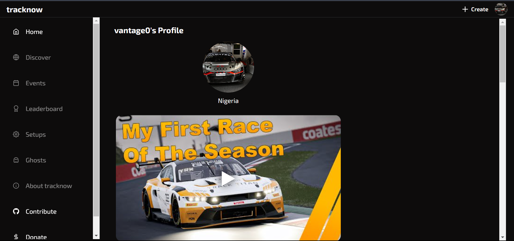

 

  
  <h3 align="center">track now</h3>
  

    share your racing moments
     
     
    <a href="https://github.com/vantage-ola/track-now"><strong>Explore the docs »</strong></a>
     
     
    <a href="https://tracknow.vantageola.com.ng/">View Alpha Version</a>
    .
    <a href="https://github.com/vantage-ola/track-now/issues">Report Bug</a>
    .
    <a href="https://github.com/vantage-ola/track-now/issues">Request Feature</a>
  

 

## Table Of Contents

- [About the Project](#about-the-project)
- [Getting Started](#getting-started)
- [Roadmap](#roadmap)
- [Contributing](#contributing)
- [License](#license)

## About The Project
`v1.0.0.alpha2.2`

TRACK NOW is a application by simracers for simracers. A platform to share racing moments with others.

Feel free to contribute by suggesting improvements and ideas to make TRACK NOW even better.

## Getting Started
- [BACKEND API README](https://github.com/vantage-ola/track-now/blob/main/tracknow/backend/README.md)
- [WEB README](https://github.com/vantage-ola/track-now/blob/main/tracknow/web/README.md)
## Roadmap

See the [open issues](https://github.com/vantage-ola/track-now/issues) for a list of proposed features (and known issues).

### Creating A Pull Request

1. Fork the Project
2. Create your Feature Branch (`git checkout -b feature/AmazingFeature`)
3. Commit your Changes (`git commit -m 'Add some AmazingFeature'`)
4. Push to the Branch (`git push origin feature/AmazingFeature`)
5. Open a Pull Request

## License

Distributed under the MIT License. See [LICENSE](https://github.com/vantage-ola/track-now/blob/main/LICENSE.md) for more information.
