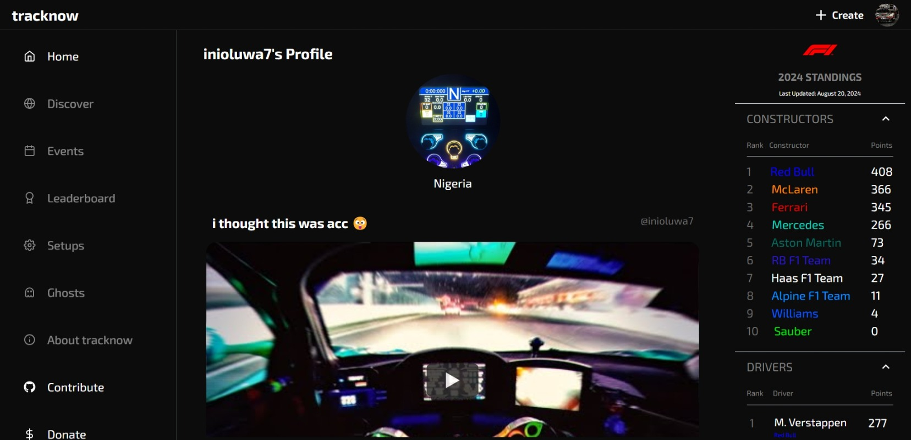

 

  
  <h3 align="center">track now</h3>
  

    share your racing moments
     
     
    <a href="https://tracknow.vercel.app/">check it out</a>
    .
    <a href="https://github.com/vantage-ola/track-now/issues">report bug</a>
    .
    <a href="https://github.com/vantage-ola/track-now/issues">request feature</a>
     
     
  

<!-- -->
<!-- -->

 

  <a>
  Distributed under the MIT License. See <a href="https://github.com/vantage-ola/track-now/blob/main/LICENSE.md">LICENSE</a> for more information.
  </a>

